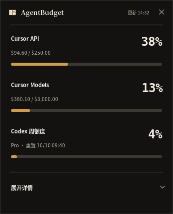
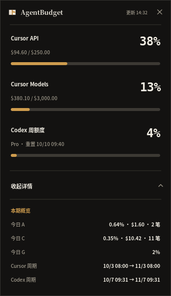

# Quiet Ledger

AgentBudget 2.0 uses a compact, three-signal hierarchy. Cursor API, Cursor Models, and the Codex weekly window are the only figures visible at rest. Each receives the same vertical rhythm: a plain label, a right-aligned tabular percentage, one line of evidence, and a restrained meter. Nothing else competes for first glance.

Headline percentages are whole numbers. A quota share is a coarse quantity that moves in visible steps, so two decimal places only added noise and invited the eye to read digits that never mattered. Precision is kept where it carries meaning instead: today's spend in a single pool is a fraction of a percent, so those rows stay at two decimals alongside the dollar figure.

Secondary accounting belongs behind progressive disclosure. Today's spend per pool, the Codex day figure, and the two subscription cycles appear only after the user selects “展开详情”. Five rows, one section: the card works as both a calm ambient instrument and a complete day ledger without forcing both modes into the same view.

A figure the machine cannot know is not dressed up. The Codex service reports only a rolling window, so a day that was sampled late reads `≥2%` rather than a confident number, and a day with nothing observed reads `—`.

The surface is warm graphite or porcelain rather than pure black or white. One muted brass accent carries normal state; a quiet red is reserved for a genuine warning. There are no decorative gradients, left-edge ribbons, neon telemetry colors, card stacks, or ornamental shadows. Hairlines separate phases, not every datum.

Typography has three jobs. A serif face gives the small product name identity, a CJK sans-serif keeps labels and evidence quiet, and a monospaced figure face makes percentages stable while they update.

The collapsed logical canvas is 348 × 430. The expanded canvas grows vertically in place to 348 × 600, preserving width and the three primary rows. The GNOME panel follows the same hierarchy using `A`, `C`, and `G` as compact labels, with a leading space keeping the figures clear of the app icon.

