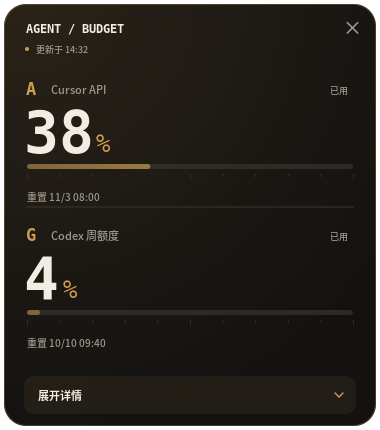
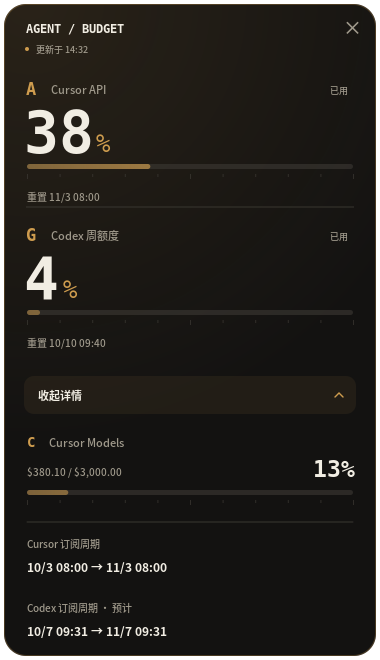

# Obsidian / Brass

AgentBudget 2.1 puts two figures first: A for Cursor API, G for the Codex weekly allowance. Large monospaced numerals and a restrained brass percentage sign make the values readable at a glance. Small captions consistently show reset times. The two windows use independent warning thresholds; red means an allowance needs attention.

The surface is warm graphite, with a soft brass light at the upper edge, a thin inset frame, and a rounded silhouette. The light variant uses warm porcelain with the same information hierarchy. There are no external font or asset downloads. A system CJK sans-serif keeps small labels legible; a local monospaced face stabilizes changing numbers.

Each meter has a continuous fill and quiet decade ticks. The expanded section contains only Cursor Models' current allowance and the two subscription cycles. Each cycle gets a separate label and date line, leaving room for the explicit “预计” marker on a projected Codex renewal. Daily consumption does not appear anywhere.

The 380 × 430 main canvas expands to 380 × 660. The details button preserves its position, has a hover treatment and keyboard focus ring, and supports Space / Enter. The close button has its own hover state. Every size setting scales the whole Cairo canvas consistently.

The GNOME label is ` A 12%  ·  G 56%` (fictional values). Spacing and a stable width guide reduce movement during refreshes. Fonts and text color remain controlled by the desktop shell.

All preview images use deterministic fictional values from the render script. No real account data is used.

